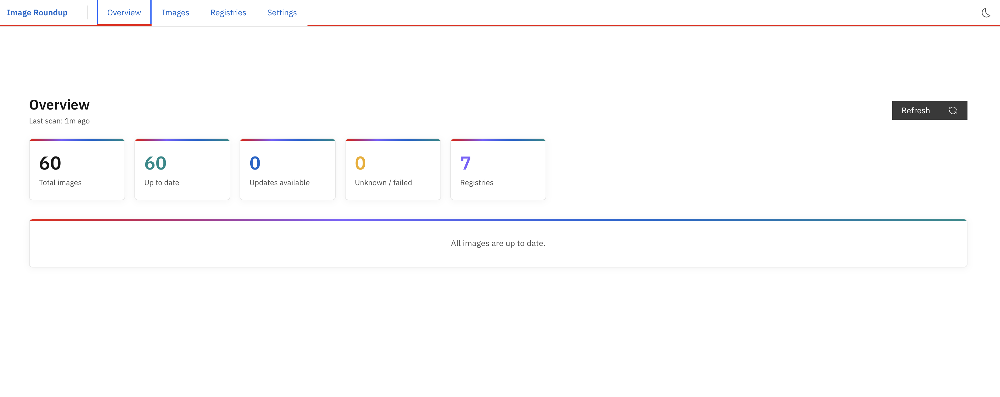
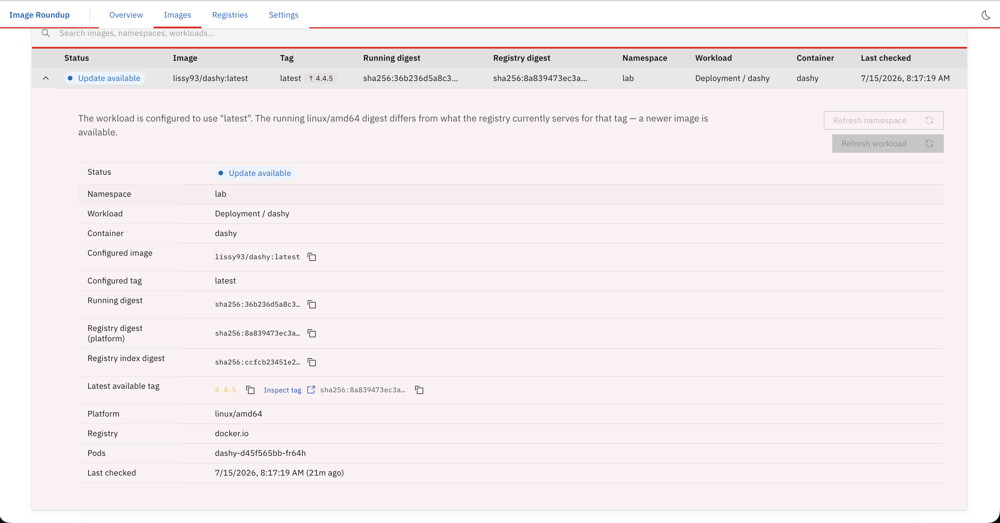
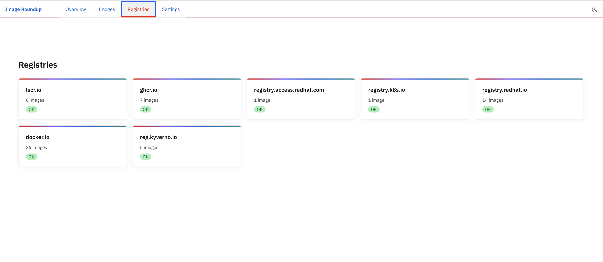

# Image Roundup

[](https://hub.docker.com/r/fumbles/image-roundup)
[](https://hub.docker.com/r/fumbles/image-roundup)

> **See what's running and what's changed.**

Image Roundup is a lightweight, read-only web application for Kubernetes and OpenShift that inventories container images running across a cluster and determines whether each workload is using the same image digest currently published by its configured registry tag.

## What it answers

- What container images are running?
- Which namespaces and workloads use each image?
- What tag is configured?
- What immutable digest is actually running?
- What digest does that registry tag resolve to now?
- Is an updated image available?

## Features

- Cluster-wide image inventory with namespace, workload, container, pod, tag,
  running digest, registry digest, and platform details.
- Digest comparison against the registry tag currently configured on each
  workload.
- Multi-arch awareness: comparisons use platform digests while preserving index
  digests for inspection.
- Compatible latest-tag hints for update candidates, with guardrails for
  architecture variants, distro variants, prerelease tags, LinuxServer streams,
  and Postgres/PostgreSQL major versions.
- Scoped manual refreshes for the full cluster, a namespace, or a workload.
- OpenShift integrated registry Route autodetection and optional internal
  registry image exclusion.
- Registry auth through a mounted Docker `config.json`.
- Light/dark Carbon UI with clickable overview tiles, URL-backed image filters,
  registry inspection links, and wrapped image columns.

## Screenshots

### Overview



### Images



### Registries



## Architecture

| Layer | Stack |
|---|---|
| Frontend | React, TypeScript, IBM Carbon Design System, Vite |
| Backend | Go, chi router, go-containerregistry, client-go |
| Deployment | Kubernetes / OpenShift, read-only RBAC |

```
┌─────────────────────────────────────────────────┐
│  Browser                                        │
│  React / Carbon UI                              │
└───────────────────┬─────────────────────────────┘
                    │ HTTP /api/v1/*
┌───────────────────▼─────────────────────────────┐
│  Go HTTP server  (:8080)                        │
│  ├─ /api/v1/summary                             │
│  ├─ /api/v1/images                              │
│  ├─ /api/v1/registries                          │
│  ├─ /api/v1/scan                                │
│  ├─ /api/v1/settings                            │
│  ├─ /healthz  /readyz  /metrics                 │
│  └─ /* → static/dist (React SPA)                │
├─────────────────────────────────────────────────┤
│  Scanner (background goroutine)                 │
│  ├─ K8s discovery (client-go)                   │
│  └─ Registry checks (go-containerregistry)      │
└─────────────────────────────────────────────────┘
```

## Getting started

### Prerequisites

- Go 1.22+
- Node 22+
- Access to a Kubernetes / OpenShift cluster

### Development

```bash
# Backend (out-of-cluster, uses ~/.kube/config)
IN_CLUSTER=false go run ./backend/cmd/server

# Frontend (dev server with proxy to :8080)
cd frontend && npm run dev
```

### Build

```bash
# Build backend
go build -o image-roundup ./backend/cmd/server

# Build frontend
cd frontend && npm run build
```

### Container Image

```bash
# build.sh prepares frontend/dist and the linux/amd64 backend binary first,
# then builds and pushes the distroless runtime image.
./build.sh 1.0.0
```

### Release Build

```bash
# Push docker.io/fumbles/image-roundup:1.0.0 and :latest
./build.sh 1.0.0

# Next patch release
./build.sh 1.0.1
```

`build.sh` does not auto-increment versions. Pass a new immutable version tag
for every release; `latest` is pushed as a moving alias for that version.

### Deploy to Kubernetes / OpenShift

```bash
# Create namespace, RBAC and ServiceAccount
kubectl apply -f deploy/k8s/rbac.yaml

# Deploy workload and Service
kubectl apply -f deploy/k8s/deployment.yaml

# OpenShift: create Route
oc apply -f deploy/k8s/route.yaml
```

## REST API

See [api.md](api.md) for polling examples, request/response shapes, and endpoint
details. Interactive API docs are served by the app at `/api/v1/docs`; the
OpenAPI document is available at `/api/v1/openapi.json`.

| Method | Path | Description |
|--------|------|-------------|
| GET | `/api/v1/docs` | Interactive API documentation |
| GET | `/api/v1/openapi.json` | OpenAPI 3.1 document |
| GET | `/api/v1/summary` | Dashboard summary counts |
| GET | `/api/v1/images` | All image records; supports `?search=&namespace=&registry=&kind=&status=` |
| GET | `/api/v1/images/{id}` | Single image record |
| GET | `/api/v1/registries` | Registry summary |
| GET | `/api/v1/scan` | Scan status |
| POST | `/api/v1/scan` | Trigger full, namespace, or workload scan |
| GET | `/api/v1/settings` | Current settings |
| PUT | `/api/v1/settings` | Update settings |
| GET | `/healthz` | Liveness probe |
| GET | `/readyz` | Readiness probe |
| GET | `/metrics` | Prometheus metrics |

Scoped scan examples:

```json
{}
```

```json
{ "namespace": "media" }
```

```json
{ "namespace": "media", "workloadKind": "Deployment", "workloadName": "plex" }
```

## Configuration (environment variables)

| Variable | Default | Description |
|----------|---------|-------------|
| `LISTEN_ADDR` | `:8080` | HTTP listen address |
| `IN_CLUSTER` | `true` | Use in-cluster Kubernetes config |
| `KUBECONFIG` | `~/.kube/config` | Path to kubeconfig (out-of-cluster) |
| `DATA_DIR` | *(empty)* | Enables NDJSON record persistence when set |
| `STATIC_DIR` | `./static` | Directory used to serve the React SPA |
| `DOCKER_CONFIG` | Docker default | Directory containing registry auth `config.json` |
| `SCAN_INTERVAL_SECONDS` | `28800` | How often to scan, in seconds |
| `REGISTRY_TIMEOUT_SECONDS` | `15` | Registry request timeout |
| `INCLUDED_NAMESPACES` | *(all)* | Comma-separated namespace allowlist |
| `EXCLUDED_NAMESPACES` | `kube-system,kube-public,kube-node-lease,openshift*` | Comma-separated namespace denylist; supports trailing `*` |
| `INCLUDE_COMPLETED_PODS` | `false` | Include succeeded/failed pods |
| `EXCLUDE_INTERNAL_REGISTRY` | `false` | Skip images that use the OpenShift internal registry service name |
| `THEME` | `system` | `system`, `light`, or `dark` |

The included Kubernetes deployment sets `DATA_DIR=/data`,
`DOCKER_CONFIG=/var/run/registry-auth`, and
`EXCLUDE_INTERNAL_REGISTRY=true`.

## Status definitions

| Status | Meaning |
|--------|---------|
| `up_to_date` | Running digest matches the current registry tag digest |
| `update_available` | Running digest differs from the current registry tag digest |
| `unknown` | Cannot make a reliable comparison (no tag, digest-only, missing runtime status) |
| `check_failed` | Registry lookup failed (auth, connectivity, rate limiting) |

## RBAC

The application uses a `ClusterRole` with read-only verbs (`get`, `list`, `watch`) on:

- `pods`, `namespaces`
- `apps`: `deployments`, `statefulsets`, `daemonsets`, `replicasets`
- `batch`: `jobs`, `cronjobs`
- `apps.openshift.io`: `deploymentconfigs` (OpenShift only)
- `route.openshift.io`: `routes` (OpenShift integrated registry discovery)
- `image.openshift.io`: `imagestreams/layers` `get` (OpenShift registry pull authorization)

Kubernetes API secret read access is not required. Registry credentials are
provided by mounting a `registry-auth` secret as
`/var/run/registry-auth/config.json`; see `deploy/k8s/registry-auth.sh`.

## Out of scope (MVP)

- Automatic workload updates or pod restarts
- Multi-cluster management
- Vulnerability scanning
- Email / webhook notifications
- Treating semantic-version tags alone as proof that a workload is outdated

## License

Apache 2.0
